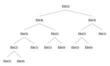

위의 사진들은 피보나치 함수의 예시이다.

 그냥 재귀 함수로만 풀게 된다면, 층마다 2개의 노드가 생김으로 시간 복잡도는 O(2^n)일 것입니다.
하지만 자세히 살펴보면, 반복되는 연산이 존재합니다. 이것을 활용하는 것을 메모라이제이션 방식이라고 합니다.


간단한 예제를 봅시다:
```cpp
vector<int> memo(n + 1, -1);
memo[0] = 0;
memo[1] = 1;

int fibo(int n, std::vector<int>& memo) {
    if (memo[n] != -1) 
    {
        return memo[n];
    }
    memo[n] = fibo(n - 1, memo) + fibo(n - 2, memo);
    return memo[n];
}
```

vector<int> memo:
메모라이제이션 방식을 사용하기 위한 변수

if (memo[n] != -1) :
이미 사용된 적 있는 노드일 경우 노드의 값을 반환

return memo[n]; :
만일 사용된 적 없을 경우, 연산을 진행하여 변수에 저장후 반환